# Ruta Libre

Aplicación multi-plataforma para monitoreo de actividad física (running) compuesta por tres módulos: móvil (Android), smartwatch (Wear OS) y Smart TV (Android TV), que comparten información a través de una API REST.

---

## Autores

César Abraham López Aguilar

Marco Antonio Martínez Ramírez

Grupo: GIDS6093-E

## Arquitectura del proyecto

```
RutaLibre/
├── app/                  # Módulo móvil (teléfono Android)
├── wearos/               # Módulo smartwatch (Wear OS)
├── tv/                   # Módulo Smart TV (Android TV)
├── core/                 # Módulo compartido (data layer)
├── source/               # Documentación, assets, scripts SQL
└── gradle/               # Configuración de Gradle y catálogo de versiones
```

El proyecto usa **3 módulos de aplicación** y **1 módulo de librería** (`:core`) que contiene toda la lógica de datos compartida: modelos, DTOs, llamadas API y repositorios. Esto evita duplicar código entre las tres plataformas.

### Dependencias entre módulos

```
:app  ──→ :core
:tv   ──→ :core
:wearos ─→ :core
```

Ningún módulo de UI depende de otro. Cada uno importa `:core` para acceder a los datos.

---

## Objetivo
Proporcionar una solución multiplataforma integral para el monitoreo de la actividad física (running), que permita a los usuarios registrar sus entrenamientos con precisión, visualizar métricas en tiempo real y fomentar la motivación a través de metas personales y competencia grupal, garantizando una experiencia fluida entre dispositivos móviles, smartwatches y televisores.

## Descripción de las funcionalidades

### Módulo Móvil (Android)
- **Registro y Autenticación**: Acceso seguro para cada usuario.
- **Monitoreo con GPS**: Seguimiento de rutas en tiempo real sobre un mapa.
- **Métricas Deportivas**: Registro de pasos, distancia, calorías quemadas y tiempo.
- **Gestión de Metas**: CRUD completo para definir objetivos diarios de entrenamiento.
- **Grupos y Comunidad**: Crear o unirse a grupos mediante códigos para compartir logros.
- **Notificaciones**: Avisos en tiempo real al cumplir objetivos o recibir logros.

### Módulo Smartwatch (Wear OS)
- **Inicio Rápido**: Lanzamiento inmediato de sesiones de entrenamiento desde la muñeca.
- **Métricas Críticas**: Visualización optimizada de distancia, pasos y tiempo durante la carrera.
- **Sincronización**: Envío automático de datos al backend al finalizar la actividad.

### Módulo Smart TV (Android TV)
- **Dashboard Estadístico**: Visualización de métricas semanales mediante gráficas interactivas.
- **Ranking Grupal**: Comparativa de rendimiento entre los miembros de un grupo.
- **Contenido Multimedia**: Acceso a videos de ejercicios y rutinas recomendadas.

## Tecnologías utilizadas
- **Lenguaje**: [Kotlin](https://kotlinlang.org/) (100% del proyecto).
- **UI**: [Jetpack Compose](https://developer.android.com/jetpack/compose) (Móvil), Compose for Wear OS y Compose for TV.
- **Arquitectura**: MVVM con separación de capas mediante el módulo `:core`.
- **Red**: [Retrofit](https://square.github.io/retrofit/) y Gson para consumo de API REST.
- **Backend**: Node.js con base de datos PostgreSQL + PostGIS.
- **Inyección de Dependencias**: Repositorios centralizados en el módulo `:core`.

---

## Instrucciones para ejecutar el proyecto

1. **Requisitos previos**:
   - Android Studio (versión reciente compatible con Compose).
   - Backend de Ruta Libre en ejecución (puerto 3000 por defecto).
   - Base de datos PostgreSQL.

2. **Configuración de la API**:
   - Localiza el archivo `core/src/main/java/mx/utng/cala/core/data/remote/RetrofitClient.kt`.
   - Ajusta la `BASE_URL` según tu entorno:
     - **Emulador**: `http://10.0.2.2:3000/api/`
     - **Físico**: `http://localhost:3000/api/` (requiere ADB reverse).

3. **Ejecución en Dispositivo Físico (USB)**:
   - Si usas un celular físico, ejecuta en la terminal:
     ```bash
     adb reverse tcp:3000 tcp:3000
     ```

4. **Despliegue**:
   - Selecciona el módulo deseado (`app`, `wearos` o `tv`) en la configuración de ejecución de Android Studio y presiona **Run**.

## Capturas de la aplicación

### Autenticación
<p align="center">
  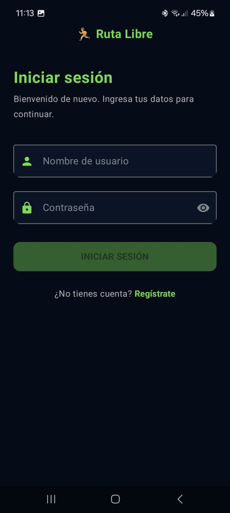
  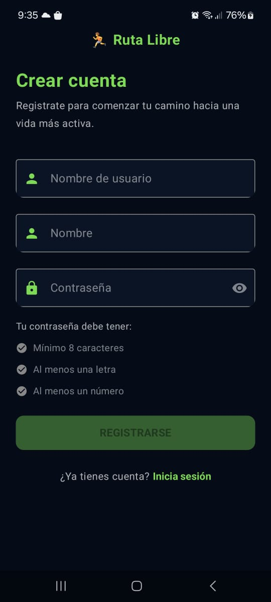
</p>

### Entrenamiento y Métricas
<p align="center">
  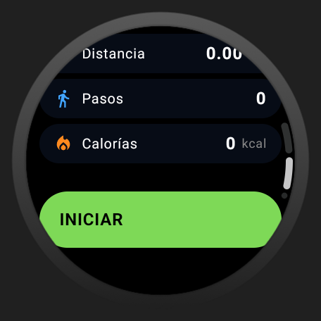
  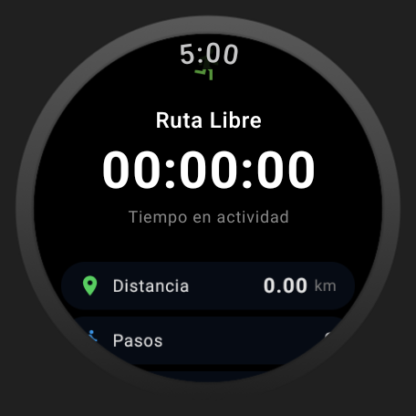
  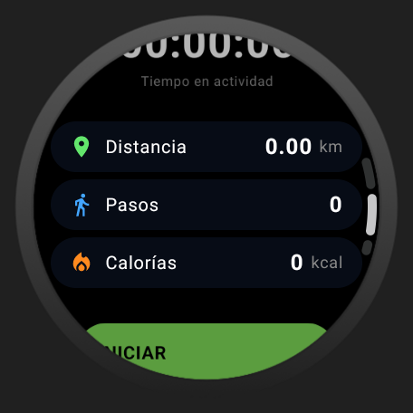
</p>
<p align="center">
  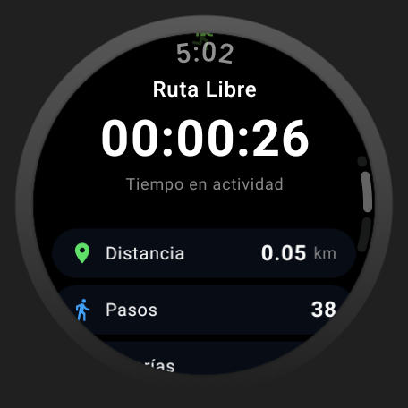
  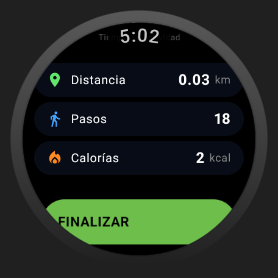
</p>

### Gestión de Metas (CRUD)
<p align="center">
  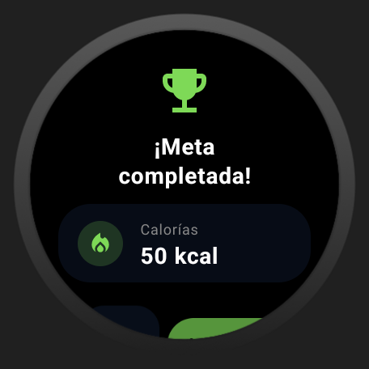
  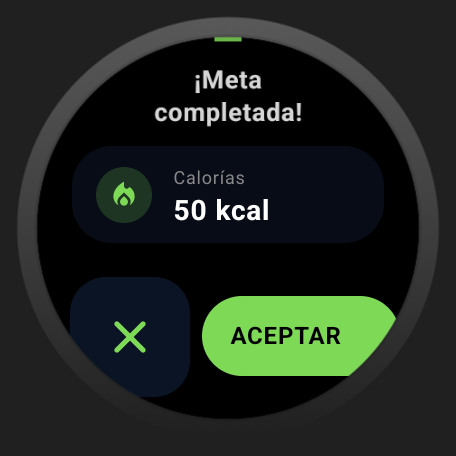
  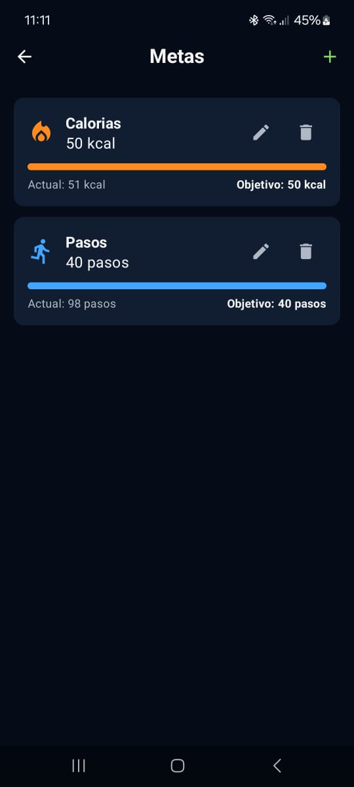
</p>
<p align="center">
  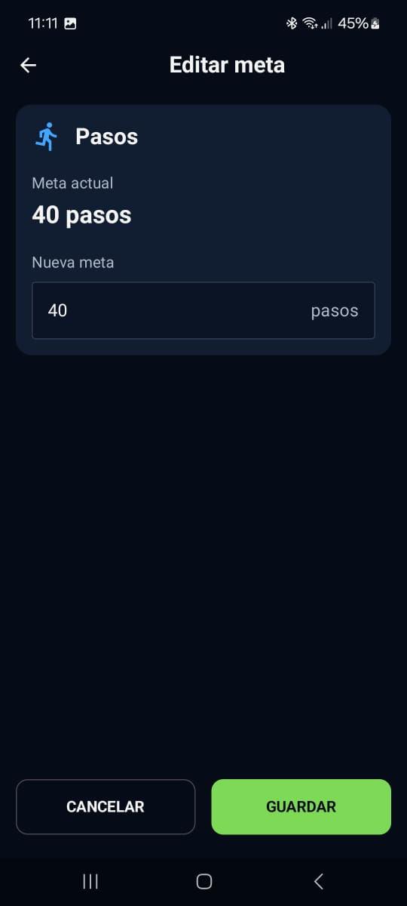
  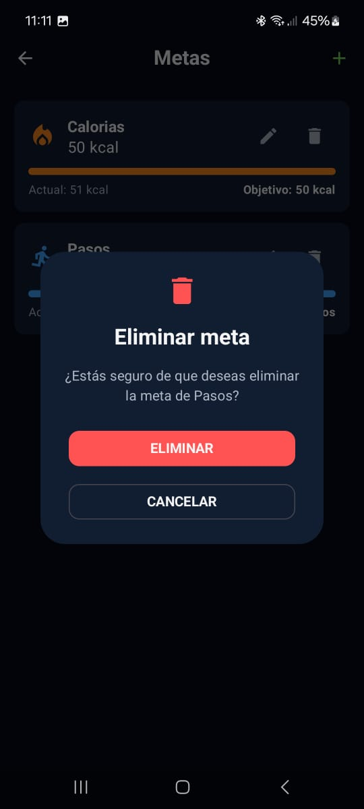
</p>
---

## Estructura detallada

### `:core` — Capa de datos compartida

```
core/src/main/java/mx/utng/cala/core/
├── data/
│   ├── model/               # Clases de dominio (data class)
│   │   ├── Usuario.kt
│   │   ├── Grupo.kt
│   │   ├── UsuarioGrupo.kt
│   │   ├── Ruta.kt
│   │   ├── Coordenada.kt
│   │   ├── Entrenamiento.kt
│   │   ├── Punto.kt
│   │   ├── Meta.kt
│   │   ├── TipoMeta.kt       # Enum: PASOS, CALORIAS, DISTANCIA, TIEMPO
│   │   └── Notificacion.kt
│   ├── dto/
│   │   ├── request/          # Objetos para enviar al backend
│   │   │   ├── LoginRequest.kt
│   │   │   ├── RegisterRequest.kt
│   │   │   ├── IniciarEntrenamientoRequest.kt
│   │   │   ├── FinalizarEntrenamientoRequest.kt
│   │   │   ├── CrearMetaRequest.kt
│   │   │   ├── CrearGrupoRequest.kt
│   │   │   ├── UnirseGrupoRequest.kt
│   │   │   └── ActualizarRutaRequest.kt
│   │   └── response/         # Objetos que devuelve el backend
│   │       ├── LoginResponse.kt
│   │       ├── UsuarioResponse.kt
│   │       ├── EntrenamientoResponse.kt
│   │       ├── EntrenamientoActivoResponse.kt
│   │       ├── MetaResponse.kt
│   │       ├── GrupoResponse.kt
│   │       ├── MiembroGrupoResponse.kt
│   │       ├── RankingResponse.kt
│   │       ├── RutaResponse.kt
│   │       ├── CoordenadaResponse.kt
│   │       ├── NotificacionResponse.kt
│   │       ├── DashboardSemanalResponse.kt
│   │       ├── RendimientoDiarioResponse.kt
│   │       └── ComparacionRendimientoResponse.kt
│   ├── remote/
│   │   ├── ApiService.kt     # Interface Retrofit con 20 endpoints
│   │   └── RetrofitClient.kt # Configuración de Retrofit (base URL, Gson)
│   └── repository/
│       ├── AuthRepository.kt
│       ├── EntrenamientoRepository.kt
│       ├── RutaRepository.kt
│       ├── MetaRepository.kt
│       ├── GrupoRepository.kt
│       └── NotificacionRepository.kt
```

**Modelos vs DTOs**: Los modelos (`model/`) representan las entidades de negocio y reflejan las tablas de la base de datos PostgreSQL. Los DTOs (`dto/`) son objetos específicos para la comunicación HTTP con el backend, separados para no acoplar el dominio a la serialización JSON.

**Repositorios**: Cada repositorio encapsula las llamadas a `ApiService` y retorna `Result<T>` para que los ViewModels manejen éxito/error de forma funcional.

---

### `:app` — Interfaz móvil (teléfono)

```
app/src/main/java/mx/utng/cala/rutalibre/
├── RutaLibreApp.kt                 # Application class
├── MainActivity.kt                 # Entry point con NavGraph
├── ui/
│   ├── navigation/
│   │   ├── Routes.kt               # Constantes de rutas
│   │   └── NavGraph.kt             # NavHost con todas las rutas
│   ├── screens/
│   │   ├── auth/
│   │   │   ├── LoginScreen.kt
│   │   │   └── RegisterScreen.kt
│   │   ├── home/
│   │   │   └── HomeScreen.kt       # Menú principal (entrenamiento, metas, grupos, perfil)
│   │   ├── entrenamiento/
│   │   │   └── EntrenamientoScreen.kt  # Mapa en tiempo real con métricas
│   │   ├── resumen/
│   │   │   └── ResumenScreen.kt    # Resumen post-actividad
│   │   ├── metas/
│   │   │   └── MetasScreen.kt
│   │   ├── grupos/
│   │   │   └── GruposScreen.kt     # Crear/unirse a grupos, ver miembros
│   │   └── perfil/
│   │       └── PerfilScreen.kt
│   ├── viewmodel/
│   │   ├── AuthViewModel.kt
│   │   ├── EntrenamientoViewModel.kt
│   │   ├── MetasViewModel.kt
│   │   └── GrupoViewModel.kt
│   └── theme/
│       ├── Color.kt                # Paleta de marca (verde #7ED957, azul #4DA3FF, etc.)
│       ├── Theme.kt                # Tema oscuro con colores personalizados
│       └── Type.kt
```

**Funcionalidades** (RF-03 a RF-08):
- Mapa con ruta en tiempo real durante entrenamiento
- Resumen de actividad al finalizar (distancia, pasos, calorías, tiempo)
- Definición y monitoreo de metas diarias
- Creación/unión a grupos mediante código único
- Notificaciones de logros al cumplir metas

---

### `:wearos` — Smartwatch (Wear OS)

> Documentación detallada del módulo → [`source/docs/DocumentacionWearOs.md`](source/docs/DocumentacionWearOs.md)

```
wearos/src/main/java/mx/utng/cala/wearos/
└── presentation/
    ├── MainActivityWearOs.kt
    ├── navigation/
    │   └── WearNavGraph.kt
    ├── screens/
    │   ├── InicioScreen.kt         # Botón para iniciar actividad
    │   └── MetricasScreen.kt       # Métricas en tiempo real (distancia, pasos, calorías, tiempo)
    ├── viewmodel/
    │   └── WearEntrenamientoViewModel.kt
    └── theme/
        ├── Color.kt
        └── Theme.kt
```

**Funcionalidades** (RF-01, RF-02, RF-06):
- Inicio/finalización de sesión de running
- Visualización rápida de métricas durante la actividad
- Notificaciones de logros al cumplir metas
- Sincronización con el móvil al finalizar

---

### `:tv` — Smart TV (Android TV)

```
tv/src/main/java/mx/utng/cala/tv/
├── MainActivityTv.kt
└── ui/
    ├── navigation/
    │   └── TvNavGraph.kt
    ├── screens/
    │   ├── dashboard/
    │   │   └── DashboardScreen.kt      # Métricas semanales con gráficas
    │   ├── grupos/
    │   │   └── GruposTvScreen.kt       # Ranking y comparativa grupal
    │   └── videos/
    │       └── VideosScreen.kt         # Videos de ejercicios y favoritos
    ├── viewmodel/
    │   ├── DashboardViewModel.kt
    │   └── GrupoTvViewModel.kt
    └── theme/
        ├── Color.kt
        ├── Theme.kt
        └── Type.kt
```

**Funcionalidades** (RF-09 a RF-11):
- Dashboard semanal con sumatorias de distancia, pasos, calorías, tiempo
- Gráficas de rendimiento diario
- Comparación de rendimiento vs semana anterior (% mejora/disminución)
- Estadísticas grupales y rankings

---

## Flujo de datos

```
💻 Backend (API REST)
      ↑↓ JSON (Retrofit)
📦 core ─── ApiService.kt ─── Repository ─── Result<T>
      ↑
📱 app / ⌚ wearos / 📺 tv
      ├── ViewModel (StateFlow<UiState>)
      └── Screen (Composable)
```

1. **Screen** llama a métodos del **ViewModel**
2. **ViewModel** invoca al **Repository** en un `viewModelScope.launch`
3. **Repository** llama a **ApiService** (Retrofit) y envuelve el resultado en `Result`
4. **ViewModel** actualiza un `StateFlow<UiState>` con los datos o el error
5. **Screen** observa el `StateFlow` con `collectAsState()` y renderiza la UI

---

## Base de datos (PostgreSQL + PostGIS)

Las tablas mapean directamente con los modelos en `core/data/model/`:

| Tabla | Modelo | Descripción |
|-------|--------|-------------|
| `usuario` | `Usuario` | Usuarios del sistema |
| `grupo` | `Grupo` | Grupos para compartir resultados |
| `usuario_grupo` | `UsuarioGrupo` | Relación M:N usuario-grupo |
| `ruta` | `Ruta` | Coordenadas JSONB del recorrido |
| `entrenamiento` | `Entrenamiento` | Sesiones de actividad física |
| `metas` | `Meta` | Metas diarias personalizadas |
| `notificacion` | `Notificacion` | Notificaciones de logros |

Relaciones clave:
- `Usuario` 1:N `Entrenamiento`
- `Usuario` 1:N `Metas`
- `Usuario` M:N `Grupo` (vía `usuario_grupo`)
- `Ruta` 1:1 `Entrenamiento`

El script de creación está en `source/db/scrip1.sql`.

---

## API REST

El `ApiService.kt` define 20 endpoints REST. La URL base por defecto apunta a `http://10.0.2.2:3000/api/` (localhost para el emulador Android). Los principales endpoints:

```
Auth:     POST /auth/login, POST /auth/register
Usuario:  GET /usuarios/{id}
Entreno:  POST /entrenamientos/iniciar, PUT /entrenamientos/finalizar
          GET /entrenamientos/activo/{idUsuario}
          GET /entrenamientos/usuario/{idUsuario}
          GET /entrenamientos/semana/{idUsuario}
          GET /entrenamientos/comparacion/{idUsuario}
Ruta:     POST /rutas/actualizar, GET /rutas/{id}
Metas:    POST /metas, GET /metas/usuario/{idUsuario}
Grupos:   POST /grupos, POST /grupos/unirse
          GET /grupos/usuario/{idUsuario}
          GET /grupos/{idGrupo}/miembros
          GET /grupos/{idGrupo}/ranking
Notif:    GET /notificaciones/usuario/{idUsuario}
          PUT /notificaciones/{id}/leer-movil
          PUT /notificaciones/{id}/leer-wear
```

---

## Tema visual (colores)

Paleta definida en `ThemeApps.md` y aplicada en los 3 módulos:

| Rol | Hex |
|-----|-----|
| Primary | `#7ED957` |
| Primary Container | `#1B5E20` |
| Secondary | `#4DA3FF` |
| Tertiary | `#7C4DFF` |
| Background | `#050B17` |
| Surface | `#0B1424` |
| On Background | `#FFFFFF` |

Colores de métricas deportivas:

| Métrica | Hex |
|---------|-----|
| Distancia | `#63E66C` |
| Pasos | `#42A5FF` |
| Calorías | `#FF8A1F` |
| Tiempo | `#7A5CFF` |

---

## Sincronización entre dispositivos (RF-07)

1. **Smartwatch** inicia/finaliza entrenamiento → envía datos al backend
2. **Móvil** recibe el entrenamiento activo, muestra ruta en mapa, actualiza coordenadas
3. Al finalizar, el **móvil** envía el registro completo (con ruta) al backend
4. **TV** consulta el histórico semanal y las comparativas desde el backend
5. Las **notificaciones** de logros se sincronizan marcando `leida_movil` / `leida_smartwatch`

Todos los dispositivos se vinculan al mismo `id_usuario`.

---


## Configuración por desarrollador

### Marco (emulador)

La configuración por defecto funciona sin cambios:

- **`core/src/main/java/mx/utng/cala/core/data/remote/RetrofitClient.kt`**:
  ```kotlin
  private const val BASE_URL = "http://10.0.2.2:3000/api/"
  ```
- El emulador traduce `10.0.2.2` al `localhost` de la laptop automáticamente.
- Solo asegúrate de que el backend esté corriendo antes de ejecutar la app.

### César (dispositivo físico por USB)

El celular no puede ver `10.0.2.2`. Hay que usar `adb reverse` para crear un túnel USB:

1. **Cambiar la URL base** en `RetrofitClient.kt`:
   ```kotlin
   private const val BASE_URL = "http://localhost:3000/api/"
   ```

2. **Conectar el celular por USB** y ejecutar este comando en la terminal:
   ```bash
   C:\Users\lopez\AppData\Local\Android\Sdk\platform-tools\adb.exe reverse tcp:3000 tcp:3000
   ```
   > Si `adb` está en el `PATH`, basta con `adb reverse tcp:3000 tcp:3000`.

3. **Rebuild** la app desde Android Studio y ejecútala en el celular.

>  El comando `adb reverse` hay que volverlo a ejecutar cada vez que se desconecte o reconecte el dispositivo USB.
